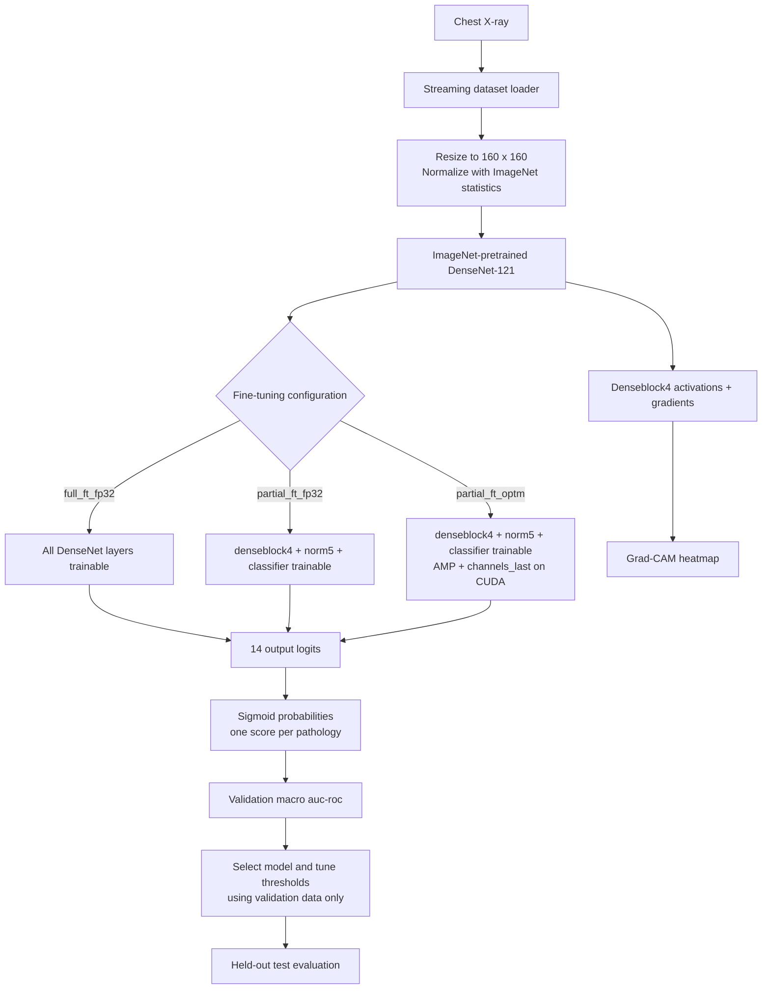

# X-Ray Disease Detector with DenseNet-121 and Grad-CAM

## Overview

This project encompasses the development of an AI/ML system for **multi-label lung-disease classification from chest X-ray images**. It uses a convolutional neural network—**DenseNet-121**—to learn visual patterns associated with 14 thoracic pathologies. The classifier is paired with **Grad-CAM**, a visualization method that creates a heatmap over the X-ray to highlight image regions that most influenced a selected pathology score.

Moreover, this work provides a simplified, reproducible framework for building and comparing **DenseNet-121 + Grad-CAM** models. Its primary focus is not only predictive quality, but also the engineering trade-off between **training time**, **classification speed**, **Grad-CAM generation time** and validation **AUC-ROC**.

The framework compares three ImageNet-pretrained DenseNet-121 configurations on the multi-label NIH ChestX-ray14 data:

- Full fine-tuned model, `full_ft_fp32`: all DenseNet-121 layers are fine-tuned in FP32;
- Partially fine-tuned model, `partial_ft_fp32`: only `denseblock4`, `norm5` and the classifier are fine-tuned in FP32;
- Partially fine-tuned optimized model, `partial_ft_optm`: the same partial fine-tuning setup, with CUDA AMP and `channels_last` enabled when a CUDA device is available.

The project is an educational ML-engineering experiment, **not** a clinical decision-support system.

---

## Features

- **Multi-label pathology classification** for 14 thoracic findings.
- **Transfer learning** with ImageNet-pretrained DenseNet-121.
- **Controlled fine-tuning comparison** between full, partial and partially optimized variants.
- **Streaming dataset loading** to avoid downloading the entire dataset before experimentation.
- **Weighted BCE loss** to help account for pathology imbalance.
- **Validation-only model selection and threshold tuning**, followed by a held-out test evaluation.
- **Runtime benchmarking** for classification and Grad-CAM generation.
- **Grad-CAM heatmaps** for qualitative inspection of model attention.
- **Reproducible run artifacts**: configuration, split manifest, class prevalence, histories, checkpoints, metrics, figures and a generated experiment report.

---

## Table of Contents

1. [Installation](#installation)
2. [Dataset](#dataset)
3. [Model Architecture](#model-architecture)
4. [Project Structure](#project-structure)
5. [Usage](#usage)
6. [Training and Evaluation](#training-and-evaluation)
7. [Results](#results)
8. [Limitations and Next Steps](#limitations-and-next-steps)

---

## Installation

### Prerequisites

- Python 3.10 or newer
- PyTorch and torchvision
- A CUDA-capable GPU is optional; CPU execution is supported but slower

Install the dependencies:

```bash
pip install torch torchvision datasets numpy pandas matplotlib pillow tqdm scikit-learn
```

Open the notebook in Jupyter:

```bash
jupyter notebook "densenet121_gradcam_framework.ipynb"
```

---

## Dataset

The experiments use [`arudaev/chest-xray-14-320`](https://huggingface.co/datasets/arudaev/chest-xray-14-320), a processed version of the NIH ChestX-ray14 dataset. Each frontal chest X-ray may have zero, one or multiple pathology labels from the following 14 classes:

```text
Atelectasis, Cardiomegaly, Effusion, Infiltration, Mass, Nodule,
Pneumonia, Pneumothorax, Consolidation, Edema, Emphysema, Fibrosis,
Pleural_Thickening, Hernia
```

The notebook loads data with Hugging Face streaming and materializes only the configured subset. This keeps setup and development runs efficient because the complete image collection does not need to be downloaded before training begins.

Each run saves:

- `split_manifest.csv`: random seed, split membership, sample position and sample identifier.
- `class_prevalence.csv`: pathology prevalence for train, validation and test subsets.

---

## Model Architecture

DenseNet-121 is initialized with ImageNet weights. Its original 1,000-class ImageNet classifier is replaced by a 14-output linear layer. Sigmoid activation converts each output logit into an independent pathology probability.



### Grad-CAM

Grad-CAM uses the activations and gradients of `denseblock4` to create a heatmap for a chosen pathology. It is a qualitative explanation of regions that influenced the model score; it does not validate clinical correctness.

---

## Project Structure

```text
.
├── densenet121_gradcam_framework.ipynb                # Main experiment notebook
├── artifacts/
│   └── runs/
│       └── <run-id>/
│           ├── config/
│           │   └── run_config.json
│           ├── checkpoints/          # Best checkpoint for each configuration
│           ├── metrics/
│           │   ├── comparison_results.csv
│           │   ├── <model>_history.csv
│           │   ├── class_prevalence.csv
│           │   └── held_out_test_metrics.csv
│           ├── manifests/
│           │   └── split_manifest.csv
│           ├── benchmarks/
│           │   └── runtime_benchmark.csv
│           ├── figures/
│           │   └── speed_quality_frontier.png
│           └── reports/
│               └── experiment_summary.md
└── README.md
```

---

## Usage

### Configure a run

In Cell 2, set the subset sizes and experiment settings:

```python
TRAIN_SIZE, VAL_SIZE, TEST_SIZE = 1000, 200, 200
COMPARISON_EPOCHS = 10
BENCHMARK_PRESET = "quick"  # use "thorough" for final runtime reporting
```

Run all notebook cells in order. The notebook creates an `artifacts/runs/<run-id>/` directory automatically and keeps outputs from each run separate.

### Runtime benchmark presets

```python
BENCHMARK_PRESET = "quick"     # development: fewer timed batches and Grad-CAM samples
BENCHMARK_PRESET = "thorough"  # final reporting: more stable timing estimates
```

Use the same preset for all three model configurations in a comparison.

---

## Training and Evaluation

### Training protocol

Each model uses:

- ImageNet-pretrained DenseNet-121
- AdamW optimizer (`learning_rate=1e-4`, `weight_decay=1e-4`)
- Weighted binary cross-entropy for the 14-label task
- `ReduceLROnPlateau` learning-rate reduction based on validation AUC-ROC
- Early stopping after repeated non-improving validation epochs
- Best-checkpoint selection by validation macro AUC-ROC

`COMPARISON_EPOCHS = 10` is the **maximum** epoch budget. Early stopping can finish a run sooner; the actual completed and best epochs are recorded in `comparison_results.csv`.

### Evaluation protocol

- Validation macro AUC-ROC selects the best checkpoint and final configuration.
- If configurations are within the configured quality tolerance, the faster training run is selected.
- Per-class decision thresholds are tuned on validation data only.
- The selected model is evaluated once on the held-out test subset.
- Classification and Grad-CAM timings are measured independently.

---

## Results

### Experimental subsets

All model and optimizer settings were held constant across four subset-size experiments.

| Run | Train | Validation | Test |
|---|---:|---:|---:|
| Small | 250 | 50 | 50 |
| Medium-small | 500 | 100 | 100 |
| Medium | 750 | 150 | 150 |
| Large development subset | 1,000 | 200 | 200 |

### Main comparison: validation quality and training time

| Train size | Model | Best validation macro AUC-ROC | Best epoch | Completed epochs | Total training time (s) |
|---:|---|---:|---:|---:|---:|
| 250 | `full_ft_fp32` | 0.5778 | 1 | 5 | 364.4 |
| 250 | `partial_ft_fp32` | **0.5940** | 3 | 7 | 256.8 |
| 250 | `partial_ft_optm` | **0.5940** | 3 | 7 | **254.6** |
| 500 | `full_ft_fp32` | 0.6714 | 7 | 10 | 1,910.8 |
| 500 | `partial_ft_fp32` | **0.6717** | 6 | 10 | 760.4 |
| 500 | `partial_ft_optm` | **0.6717** | 6 | 10 | **735.7** |
| 750 | `full_ft_fp32` | **0.7435** | 5 | 9 | 2,261.5 |
| 750 | `partial_ft_fp32` | 0.6972 | 5 | 9 | 1,005.0 |
| 750 | `partial_ft_optm` | 0.6972 | 5 | 9 | **1,001.2** |
| 1,000 | `full_ft_fp32` | **0.7367** | 3 | 7 | 2,439.9 |
| 1,000 | `partial_ft_fp32` | 0.7053 | 5 | 9 | 1,361.8 |
| 1,000 | `partial_ft_optm` | 0.7053 | 5 | 9 | **1,317.6** |

### Key findings

- On the 250-image subset, the partially fine-tuned optimized model reached a higher validation AUC-ROC than full fine-tuned model while taking about **30% less total training time**.
- At 500 images, the partial models were effectively tied with, and marginally above, full fine-tuning model on validation AUC-ROC; the difference is too small for a strong superiority claim.
- At 750 and 1,000 images, the full fine-tuned model achieved the higher validation AUC-ROC, while both the partially fine-tuned optimized and standard models remained about **56%** and **46%** faster, respectively.
- The partially fine-tuned optimized model was consistently the fastest training variant among the two partial configurations. Its gain over the  partially fine-tuned standard model was modest, whereas its training-time advantage over full fine-tuning was substantial.
- Grad-CAM was consistently faster for the partial configurations than the full fine-tuned in these four runs. Classification latency was more variable: optimization did not improve it consistently on this hardware.

The appropriate conclusion is a **speed-quality trade-off**, not that one configuration is universally best. The partially fine-tuned model is attractive for rapid experimentation and limited compute; the full fine-tuned model becomes more competitive when maximizing validation quality on larger subsets.

---

## Limitations and Next Steps

- **Subset-based evidence:** The four experiments use extracted subsets of the full dataset. Their results should not be presented as full-dataset or clinical performance. Larger, representative, ideally patient-level splits are needed for stronger conclusions.
- **Limited training profile:** Ten epochs is a maximum budget, not a full convergence study. Increasing the maximum epoch budget and using a larger validation set would better reveal the learning profiles of full and partial fine-tuning.
- **Small validation/test sets:** Rare pathologies may have very few positive examples, making per-class metrics unstable.
- **Hardware-specific timing:** Runtime values depend on device, PyTorch version, data loading, image resolution, batch size and benchmark preset. Compare configurations only within the same run environment.
- **Streaming efficiency:** Streaming removes the need to pre-download the whole dataset and enables efficient subset experimentation. It does not replace full-data training when the goal is a robust final model.
- **Future work:** Run the final comparison on a larger or complete dataset, repeat across multiple seeds, add confidence intervals and use the `thorough` benchmark preset for final speed claims.

---

## Acknowledgements

- [NIH ChestX-ray14](https://nihcc.app.box.com/v/ChestXray-NIHCC)
- [arudaev/chest-xray-14-320](https://huggingface.co/datasets/arudaev/chest-xray-14-320)
- [PyTorch](https://pytorch.org/)
- [Torchvision DenseNet-121](https://pytorch.org/vision/stable/models/densenet.html)
