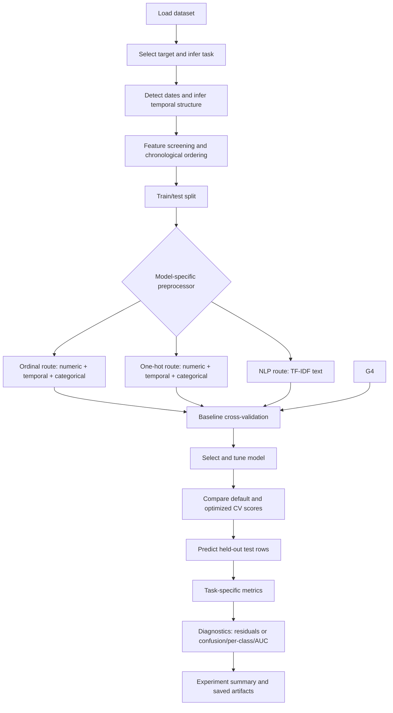

# FitPredict - Automated Regression and Classification Platform

## Overview

This project provides a guided machine-learning workflow for selecting, optimizing and evaluating a regression or classification model for a user-chosen dataset and target variable.

The platform automates several decisions that are often handled manually. It infers whether the selected target represents a regression or classification problem, checks for possible time-series structure, chooses an appropriate data-splitting and validation strategy, removes selected non-crucial or potentially leaking columns and prepares numeric, temporal and categorical features for different estimator families.

For regression projects, the framework compares:

- Multiple linear regression
- Polynomial regression
- Support vector regression 
- Decision tree regression
- Random forest regression
- XGBoost regression

For classification projects, the framework compares:

- Logistic regression
- Gaussian Naive Bayes
- K-nearest neighbors
- Support vector machine 
- Decision tree classification
- Random forest classification
- XGBoost classification

The strongest initial candidate is selected through cross-validation, optimized with either successive-halving randomized search or randomized search, compared with its baseline and evaluated on the held-out test set. 

In regression the evaluation is conducted through the mean absolute error (MAE), root mean squared error (RMSE) and R². Diagnostics also report residual analysis; in classification the evaluation is conducted through macro F1, accuracy, balanced accuracy, macro precision and macro recall. Diagnostics also report a confusion matrix, per-class metrics, ROC-AUC and PR-AUC when supported.

The project is designed as an educational and experimental AutoML-style framework. It assists model discovery, but does not remove the need for domain knowledge, leakage checks, suitable validation design and independent review of the final model.

## Features

- Interactive dataset target selection and heuristic regression/classification detection.
- Heuristic date/time discovery, user selection of an ordering column, chronological sorting and time-aware CV when inferred.
- Feature-only removal of empty, constant, sensitive, media-reference, and high-cardinality identifier columns, with a saved removal report.
- A model-specific `ColumnTransformer` with three preprocessing routes: ordinal categorical encoding, one-hot categorical encoding and natural language processing (NLP) TF-IDF for a selected long-text field. Numeric imputation/scaling and date-component extraction feed the relevant structured-data route.
- Cross-validated baseline comparison, size-based exclusions for expensive models and successive-halving parameter search.
- Regression and classification test metrics plus holdout diagnostics: residual plots for regression; confusion matrix, per-class report, ROC-AUC and PR-AUC for classification.
- A generated Markdown experiment summary with performance interpretation and diagnostic/statistical observations.
- Run-scoped configuration, split/removal manifests, model profiles, CV results, final metrics, diagnostic figures and summary artifacts.

## Table of Contents

- [Installation](#installation)
- [Dataset](#dataset)
- [Model Architecture](#model-architecture)
- [Project Structure](#project-structure)
- [Usage](#usage)
- [Training and Evaluation](#training-and-evaluation)
- [Results](#results)
- [Limitations and Next Steps](#limitations-and-next-steps)

## Installation

### Prerequisites

- Python 3.10 or newer
- Jupyter Notebook or JupyterLab
- Sufficient RAM for encoded high-cardinality datasets
- A multi-core CPU is recommended
- A CUDA-capable GPU is optional if XGBoost is later configured for GPU execution

Create and activate a virtual environment, then install the dependencies:

```bash
python -m venv .venv
```

Windows PowerShell:

```powershell
.venv\Scripts\Activate.ps1
```

Install the required packages:

```bash
pip install jupyter datasets numpy pandas scipy scikit-learn xgboost matplotlib joblib
```

Open the notebook:

```bash
jupyter notebook "fitpredict_platform.ipynb"
```

`HalvingRandomSearchCV` is experimental in scikit-learn and is enabled inside the notebook before it is imported.

## Dataset

The framework is intended to work with different tabular datasets rather than one fixed dataset. The current notebook loads a Hugging Face dataset with:

```python
dataset = load_dataset(DATASET_NAME, split="train")
dataset_df = dataset.to_pandas()
```

Set `DATASET_NAME` in the **Directory** cell before running an experiment. A compatible dataset should:

- Be representable as a pandas DataFrame.
- Contain the desired target as one column.
- Use numeric, boolean, categorical, string or date/time feature columns.
- Have enough valid target observations for the selected split and cross-validation strategy.

The notebook prompts the user to choose the target column. If possible date/time fields are detected, it also prompts the user to choose the ordering column.

Because the framework is dataset-independent, experimental dataset descriptions, licenses, target definitions and known biases should be documented separately for every run.

## Model Architecture

The notebook is a branching classical machine-learning workflow. After dataset setup, target selection, task/time-series heuristics, feature screening, and train/test splitting, each model selects a fresh `ColumnTransformer`. Its three parallel preprocessing routes are:

1. **Ordinal encoding:** median imputation and optional scaling for numeric columns; most-frequent imputation and ordinal encoding for categorical columns. Used by tree-based and Naive Bayes models.
2. **One-hot encoding:** numeric imputation/scaling plus most-frequent categorical imputation and sparse one-hot encoding. Used by linear models, polynomial regression, SVR, logistic regression, SVM, KNN and XGBoost.
3. **NLP:** : Uses TF-IDF to convert the selected text column into numeric features. This route is specifically for bag-of-words text-classification projects.




### Model families

Regression candidates include multiple linear regression, polynomial regression, decision tree, random forest, XGBoost, and row-limited SVR. Classification candidates include logistic regression, Naive Bayes, decision tree, random forest, XGBoost, row-limited KNN and row-limited SVM. Estimator/preprocessor compatibility and model-specific limits should be reviewed before interpreting results.

## Project Structure

The following structure extends the notebook's existing run directories into a reproducible experiment layout:

```text
.
├── fitpredict_platform.ipynb               # Main guided workflow
├── README.md
├── requirements.txt                         
└── artifacts/
    └── runs/
        └── <run-id>/
            ├── config/
            │   ├── run_config.json          # Dataset, target, seed and thresholds
            │   └── environment.txt          # Package and Python versions
            ├── checkpoints/
            │   ├── preprocessor_nlp.joblib      # if selected
            │   ├── preprocessor_ohe.joblib     # if selected
            │   ├── preprocessor_oe.joblib      # if selected
            │   ├── model_default_profile.joblib
            │   ├── best_parameters_optm.joblib
            │   └── model_optimized_profile.joblib
            ├── manifests/
            │   ├── dimensionality_reduction_report.csv
            │   └── split_manifest.csv       # Train/test row membership
            ├── metrics/
            │   ├── model_comparison.csv
            │   ├── optimization_cv_results.csv
            │   └── final_evaluation_results.csv
            ├── figures/
            │   ├── prediction_and_residuals.png # Regression
            │   └── confusion_matrix.png         # Classification
            └── reports/
                └── experiment_summary.md
```

The notebook currently writes these run artifacts:

- `config/run_config.json`
- `manifests/dimensionality_reduction_report.csv`, `manifests/processed_dataset.csv` and `manifests/split_manifest.csv`
- `checkpoints/preprocessor_ohe.joblib`, `checkpoints/preprocessor_oe.joblib` and/or `checkpoints/preprocessor_nlp.joblib` (preprocessor templates), plus `model_default_profile.joblib`, `model_optimized_profile.joblib` and `best_parameters_optm.joblib`
- `metrics/model_comparison.csv`, `metrics/optimization_cv_results.csv` and `metrics/final_evaluation_results.csv`
- `figures/prediction_and_residuals.png` for regression or `figures/confusion_matrix.png` for classification
- `reports/experiment_summary.md`

The current notebook does not persist a final estimator or prediction table. The model profile files should not be treated as a complete fitted deployment artifact.

## Usage

### Configure a run

In the **Directory** cell, set `DATASET_NAME`, optional `DATASET_CONFIGURATION` and `SPLIT`. Project type and time-series status are currently inferred heuristically; verify both before interpreting metrics.

Run all notebook cells in order. During execution:

1. In **Target Column Selection**, enter the number of the dependent variable.
2. Review inferred project type and temporal status; both are heuristic.
3. If date fields are found, choose the column used to assess chronological order.
4. Review the columns proposed for removal in **Dimensionality Reduction**.
5. Inspect the transformed shapes in **Preprocessing Pipelines**, particularly after one-hot encoding.
6. Review the cross-validation table in **Model Selection**.
7. Allow model comparison, optimization and default-versus-optimized selection to complete.
8. Review held-out metrics, diagnostics and the generated experiment summary. The current code does not save a final estimator or row-level prediction file.

The notebook creates an `artifacts/runs/<run-id>/` directory automatically. 

## Training and Evaluation

### Model-selection protocol

The framework compares baseline estimators on the training partition only:

- Cross-sectional regression uses `KFold`.
- Cross-sectional classification uses `StratifiedKFold`.
- Time-ordered regression and classification use `TimeSeriesSplit`.
- Regression candidates are ranked primarily by mean cross-validated MAE and then R².
- Classification candidates are ranked by mean macro F1 and then balanced accuracy.

RBF SVR, RBF SVM and exact KNN are excluded when the configured row threshold is exceeded because their computational cost can become impractical on large datasets.

### Hyperparameter optimization

The highest-ranked baseline candidate is passed to `RandomizedSearchCV` for time-series projects or to `HalvingRandomSearchCV` for any other kind of projects. Successive halving evaluates several configurations with limited resources, discards weaker candidates and allocates more resources to the survivors. Baseline model comparison uses two folds; hyperparameter search uses five folds and refits the winner. The notebook compares candidate CV scores on the same training data, so those comparisons are selection-biased rather than independent validation estimates.

### Final evaluation

The held-out test partition is used after model selection and optimization:

Regression metrics:

- **MAE:** average absolute prediction error in target units.
- **RMSE:** penalizes larger errors more strongly.
- **R²:** proportion of target variance explained relative to a mean baseline.

Classification metrics:

- **Macro F1:** balances per-class precision and recall while giving each class equal weight.
- **Accuracy:** fraction of predictions classified correctly.
- **Balanced accuracy:** average recall across classes.
- **Macro precision:** average class-level precision.
- **Macro recall:** average class-level recall.

Cross-validation metrics and final test metrics are not expected to match exactly. Cross-validation estimates performance from folds within the training set, while the final metrics measure one separately held-out test set. A large discrepancy, however, should trigger checks for distribution shift, overfitting, leakage or an unsuitable split.

## Results

Results were established through six experiments: two regression projects, two classification projects, one time-series project and one bag-of-words NLP project. 

### Regression experiments

| ID | Dataset | Size | Structure | Selected model | CV MAE | CV RMSE | CV R² | Test MAE | Test RMSE | Test R² |
|---|---|---|---|---:|---:|---|---|---:|---:|---:|---:|---:|---:|---:|
| R1 | electricsheepafrica/africa-synth-education-waec-results-nigeria | 500K | Cross-sectional | XGBoost | 5.25 | 9.09 | 0.66 | 5.26 | 9.12 | 0.66 | 
| R2 | Einae/Zinc_standard_agent | 2M | Cross-sectional | Multiple Linear Regression | 0.22 | 0.38 | 0.95 | 0.22 | 0.37 | 0.95 |
| R3 | opensporks/stocks | 3.34M | Time-series | Decision Tree | 1.67 | 2.50 | 0.67 | 0.063 | 0.31 | 0.997 |


### Classification experiments

| ID | Dataset | Size | Structure | Selected model | CV Macro F1 | CV Balanced Accuracy | Test Macro F1 | Test Balanced Accuracy | Test Accuracy | Test Precision | Test Recall |
|---|---|---|---|---:|---:|---|---|---:|---:|---:|---:|---:|---:|---:|---:|
| C1 | mstz/covertype | 581K | Cross-sectional | Random Forest | 0.88 | 0.85 | 0.92 | 0.89 | 0.95 | 0.94 | 0.89 | 
| C2 | DBbun/1M_Insomnia_Nature_SR_2018_v1.0 | 1.11M | Cross-sectional | Logistic Regression | 0.77 | 0.76 | 0.77 | 0.77 | 0.79 | 0.78 | 0.77 | 
| C3 | Yelp/yelp_review_full | 650K | Bag-of-words NLP | Logistic Regression | 0.58 | 0.59 | 0.59 | 0.59 | 0.59 | 0.59 | 0.59 | 


## Limitations and Next Steps

- **Supported structures and data formats:** The platform supports CSV, TSV and Parquet datasets from HuggingFace containing flat, tabular data, where each cell holds a single scalar value. It does not support other file formats or nested, multi-valued fields such as lists, arrays or objects within a cell.
- **Large datasets:** One-hot expansion, cross-validation and hyperparameter search may require substantial time and memory. Exact KNN and RBF-kernel SVM/SVR are particularly unsuitable at very large row counts.
- **Heuristic task detection:** Numeric targets with low cardinality may represent either classification labels or legitimate regression quantities; confirm the inferred task before interpreting results.
- **Metric variation:** Model-selection scores are computed from training folds, whereas final metrics come from the held-out test partition. Small differences are normal; large differences require investigation.
- **NLP support:** The NLP route is available only for classification and processes one text column, selected using length and cardinality heuristics. It assumes English stopwords and does not currently support text regression or multilingual data. Named-entity recognition (NER) tasks are also not supported.
- **Multiple time series:** Time-series analysis supports a single series. If a dataset contains multiple series, the platform automatically selects the first one it detects; verify that this is the intended series before interpreting results.
- **Target data quality:** The target column must contain valid, consistently formatted values. Invalid or inconsistent target data may cause the workflow to stop with an error, so validate the target before running the analysis.
- **Predictive signal:** The platform expects the available features to contain enough information to predict the target. If the signal is too weak or the target is mostly unpredictable, it may be unable to select a suitable model and stop with an error.

## Acknowledgements

- [Yelp/yelp_review_full](https://huggingface.co/datasets/Einae/Zinc_standard_agent)
- [Einae/Zinc_standard_agent](https://huggingface.co/datasets/Einae/Zinc_standard_agent)
- [DBbun/1M_Insomnia_Nature_SR_2018_v1.0](https://huggingface.co/datasets/DBbun/1M_Insomnia_Nature_SR_2018_v1.0)
- [electricsheepafrica/africa-synth-education-waec-results-nigeria](https://huggingface.co/datasets/electricsheepafrica/africa-synth-education-waec-results-nigeria)
- [opensporks/stocks](https://huggingface.co/datasets/opensporks/stocks)
- [mstz/covertype](https://huggingface.co/datasets/mstz/covertype)
- [pandas](https://pandas.pydata.org/)
- [NumPy](https://numpy.org/)
- [scikit-learn](https://scikit-learn.org/)
- [XGBoost](https://xgboost.readthedocs.io/)
